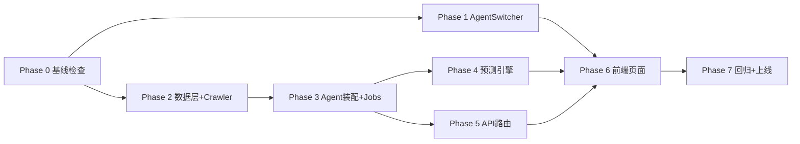

# 实施计划：多 Agent 平台 - AgentSwitcher 重构 + CS2 饰品市场 Agent

**规划时间**：2026-04-07
**规划范围**：任务 1（AgentSwitcher 单击式重构）+ 任务 2（CS2 饰品市场 Agent 全栈实施）
**预估总工作量**：大（含 6 个 Phase + 1 个回归 Phase）

---

## 1. 总览

### 1.1 目标

1. 把 Agent 切换从「下拉两步」重构为「按钮一步」，并为新 Agent 引入主题色机制
2. 新增第三个 Agent（CS2 饰品市场），覆盖采集 / 存储 / 预测 / API / 前端 6 个页面，做到与 investment、tech_info 完全隔离

### 1.2 范围

**包含**：
- AgentSwitcher 重写 + 主题色 CSS 变量切换
- CS2 后端：4 张新表 + 3 个 crawler + 6 个定时任务 + 15 个 API 端点 + 2 个 builtin skill
- CS2 前端：6 个页面 + 7 个专属组件 + 1 个 API 模块
- 回归测试 investment / tech_info 不受影响

**不包含**：
- BUFF / YOUPIN 爬虫（封禁风险高，留给 V2）
- LSTM / Prophet 等 ML 模型（数据量不足）
- 全量 34k 饰品采集（先维护 200-500 个热门清单）
- 移动端独立 App（仅响应式适配）

### 1.3 技术约束

- 后端必须沿用 `app.platform.AgentRegistry` + `SchedulerKernel` + `CrawlerManager`，不重建基础设施
- 数据库走独立表，不复用 articles 表
- 前端必须用 React.lazy code-splitting，避免影响首屏
- LLM 调用必须复用 `app.ai.client`（OpenAI/Anthropic 双格式）
- Steam Market API 速率限制：单 IP 约 20 req/min，需错峰批次

---

## 2. Phase 分解总览

| Phase | 主题 | 依赖 | 复杂度 |
|---|---|---|---|
| Phase 0 | 基线检查 | — | 小 |
| Phase 1 | AgentSwitcher 重构 + 主题色 | Phase 0 | 小 |
| Phase 2 | CS2 数据层 + Crawler | Phase 0 | 中 |
| Phase 3 | CS2 Agent 装配 + 定时任务 | Phase 2 | 中 |
| Phase 4 | CS2 预测引擎 + Skills | Phase 3 | 中 |
| Phase 5 | CS2 API 路由 | Phase 3 | 中 |
| Phase 6 | CS2 前端页面 | Phase 1 + Phase 5 | 大 |
| Phase 7 | 回归 + 上线检查 | 全部 | 小 |

---

## Phase 0：基线检查（pre-check）

**目标**：确认 investment 和 tech_info 当前为可用基线，给后续改动留下回退锚点。

### 0.1 任务

| # | 任务 | 操作 | 关键约束 |
|---|---|---|---|
| 0.1 | 创建 git tag `pre-cs2-baseline` | 新建 | 用作整体回退点 |
| 0.2 | 启动后端 + 前端，手动验证 `/invest/*` 和 `/tech/*` 全部页面可加载 | 验证 | 无控制台错误，无 500 |
| 0.3 | 调用 `/api/dashboard/stats?agent_key=investment` 和 `?agent_key=tech_info` | 验证 | 两次返回结构一致 |
| 0.4 | 检查 `scheduler` 注册的 job 列表，记录 investment / tech_info 当前所有 job_id | 记录 | 写入 `.claude/plan/cs2-baseline-jobs.txt` |
| 0.5 | 备份 `backend/data/news_agent.db` 到 `backend/data/news_agent.db.pre-cs2.bak` | 备份 | 文件级冷备 |

### 0.2 验收标准

- `git tag` 成功创建
- 两个 agent 的 8 个核心页面 + 主要 API 全部 200
- baseline jobs 清单已落档
- DB 冷备文件存在

### 0.3 回退方案

无需回退（仅为后续 Phase 提供基线）。

---

## Phase 1：AgentSwitcher 重构 + 主题色机制

**目标**：单击切换 + 三 Agent 主题色 CSS 变量

### 1.1 任务

| # | 文件 | 操作 | 关键约束 |
|---|---|---|---|
| 1.1 | `frontend/src/config/agents.ts` | 修改 | 追加 CS2 Agent 定义：`id: 'cs2_market'`、`name: 'CS2 饰品'`、`shortName: 'CS2'`、`pathPrefix: '/cs2'`、`accentClass: 'bg-amber-600'`、`icon: Package`、`description: '...'`；保持现有 investment / tech 顺序 |
| 1.2 | `frontend/src/styles/agent-themes.css` | 新建 | 定义 `[data-agent="investment"]`、`[data-agent="tech_info"]`、`[data-agent="cs2_market"]` 三组 CSS 变量（`--agent-accent`、`--agent-accent-soft`、`--agent-ring`）；研选 blue-600，技术 violet-600，CS2 amber-600 |
| 1.3 | `frontend/src/main.tsx` | 修改 | 引入 `./styles/agent-themes.css`，置于 `index.css` 之后 |
| 1.4 | `frontend/src/components/AgentSwitcher.tsx` | 重写 | 按 UI 设计师方案：`grid grid-cols-3 gap-1.5`，每按钮 `flex flex-col items-center justify-center gap-1 py-2.5`；激活态加 2px 顶部高亮条；下方 `
` 动态显示 currentAgent.description；Agent 数 ≥ 4 时切换 `grid-cols-2`；移动端 `max-md:py-3.5` |
| 1.5 | `frontend/src/components/Layout.tsx` | 修改 | useEffect 中 `document.documentElement.setAttribute('data-agent', currentAgentId)`；卸载时不清除（保留主题）|
| 1.6 | `frontend/src/stores/agent.ts` | 修改 | 在 `agents` 数组中纳入 cs2_market（从 config 读取，不硬编码）；persist key 不变 |

### 1.2 验收标准

- 切换 3 个按钮，URL 自动跳转到对应 pathPrefix 的根路径
- 激活按钮颜色 + 顶部高亮条正确显示
- `<html data-agent="...">` 属性随切换变化
- 刷新后保持上次选中的 Agent
- 切到 cs2_market 时，因为后端路由未就绪，前端页面会 404 或显示空（预期）

### 1.3 回退方案

`git checkout HEAD -- frontend/src/components/AgentSwitcher.tsx frontend/src/config/agents.ts frontend/src/components/Layout.tsx`，删除 `agent-themes.css`。

---

## Phase 2：CS2 数据层 + Crawler

**目标**：表结构落地 + 3 个 crawler 可独立调用

### 2.1 任务

| # | 文件 | 操作 | 关键约束 |
|---|---|---|---|
| 2.1 | `backend/app/models/cs2_item.py` | 新建 | `CS2Item` 模型；`market_hash_name` 唯一索引；字段按规划 |
| 2.2 | `backend/app/models/cs2_price.py` | 新建 | `CS2PriceSnapshot` 模型；复合索引 `(item_id, snapshot_time DESC)`；只增不改 |
| 2.3 | `backend/app/models/cs2_prediction.py` | 新建 | `CS2Prediction` 模型；`factors` 用 `JSONField`；复合索引 `(item_id, period, generated_at DESC)` |
| 2.4 | `backend/app/models/cs2_watchlist.py` | 新建 | `CS2Watchlist` 模型；`UNIQUE(user_id, item_id)`；外键 users.id |
| 2.5 | `backend/app/models/__init__.py` | 修改 | 导出 4 个新模型；确保 `Base.metadata.create_all` 能识别 |
| 2.6 | `backend/app/database.py` | 验证 | 确认启动时自动建表（不写 migration，沿用项目现有 create_all 风格）|
| 2.7 | `backend/app/crawlers/steam_market.py` | 新建 | 继承 `CrawlerPlugin`；`name = 'steam_market'`；按 `market_hash_name` 列表分批请求 `/market/priceoverview/?currency=23&market_hash_name=...`（CNY=23）；每批之间 sleep ≥ 3s 防限流；失败重试 3 次 + 指数退避 |
| 2.8 | `backend/app/crawlers/csgoskins_gg.py` | 新建 | 继承 `CrawlerPlugin`；`name = 'csgoskins_gg'`；读 settings 中 API key；返回多平台价格列表；免费额度耗尽时返回空数组 + warning log，不抛异常 |
| 2.9 | `backend/app/crawlers/cs2_patchnotes.py` | 新建 | 继承 `CrawlerPlugin`；`name = 'cs2_patchnotes'`；爬 steamdb.info/app/730/patchnotes；解析 patch 标题 + 发布日期 + 摘要；UA 伪装 + 失败降级 |
| 2.10 | `backend/app/crawlers/manager.py` | 修改 | 在 crawler 注册表追加 3 个新 crawler；不影响 8 个已有 crawler |
| 2.11 | `backend/app/agents/cs2_market/items_catalog.py` | 新建 | 维护「热门饰品种子清单」数据结构 + `seed_initial_items()` 函数；首次启动时若 `cs2_items` 表为空，插入 200-500 条 |

### 2.2 验收标准

- 启动后端，`cs2_items` / `cs2_price_snapshots` / `cs2_predictions` / `cs2_watchlist` 4 张表自动创建
- 手动调用 `crawler_manager.run('steam_market', items=['AK-47 | Redline (Field-Tested)'])` 能拿到价格
- `csgoskins_gg` 在无 key 时返回 `[]` 不抛异常
- `cs2_patchnotes` 能返回最近 10 条 patch
- investment / tech_info 启动 / DB / API 全部正常（执行 Phase 0 的 0.2 步骤复测）

### 2.3 回退方案

- DB：`sqlite3 news_agent.db "DROP TABLE cs2_items; DROP TABLE cs2_price_snapshots; DROP TABLE cs2_predictions; DROP TABLE cs2_watchlist;"`
- 代码：`git checkout` 对应文件 + 删除新建文件
- 必要时直接 `cp news_agent.db.pre-cs2.bak news_agent.db`

---

## Phase 3：CS2 Agent 装配 + 定时任务

**目标**：注册到 AgentRegistry，6 个 job 在 SchedulerKernel 跑起来

### 3.1 任务

| # | 文件 | 操作 | 关键约束 |
|---|---|---|---|
| 3.1 | `backend/app/agents/cs2_market/__init__.py` | 新建 | 暴露 `register_cs2_market_agent()`；构造 `AgentManifest(key='cs2_market', name='CS2 饰品', ...)`；注册到 `AgentRegistry` |
| 3.2 | `backend/app/agents/cs2_market/defaults.py` | 新建 | `BUILTIN_SKILLS` 列表（2 个）+ `DEFAULT_SETTINGS`（fetch interval / prediction time / 提醒开关 等）|
| 3.3 | `backend/app/agents/cs2_market/jobs.py` | 新建 | `register_cs2_jobs(scheduler)`；6 个 job：`cs2_market:fetch_prices`(*/5min)、`cs2_market:fetch_csgoskins`(*/30min)、`cs2_market:fetch_patchnotes`(daily 08:00)、`cs2_market:generate_predictions`(daily 09:00)、`cs2_market:check_alerts`(*/5min)、`cs2_market:cleanup_snapshots`(daily 03:00)；全部走 SchedulerKernel namespace 命名 |
| 3.4 | `backend/app/main.py` | 修改 | `lifespan` 中调用 `register_cs2_market_agent()`；位置紧跟 investment / tech_info 注册之后 |
| 3.5 | `backend/app/agents/cs2_market/jobs.py` | 实现 | `job_fetch_prices`：从 `cs2_items where is_tracked=true` 取列表 → 分批喂 steam_market crawler → 写 snapshots（注意去重：同 item 同 minute 只留一条）|
| 3.6 | 同上 | 实现 | `job_check_alerts`：扫 watchlist + 对比最近一条 snapshot；触发后调 `notifiers.send_markdown`，标记 `triggered=true` |
| 3.7 | 同上 | 实现 | `job_cleanup_snapshots`：删除 90 天前的 snapshots；保留每日最低 / 最高 / 收盘三条聚合（写入同表用 `is_aggregated` 字段；如不加字段就直接保留 90 天内全量，简单做）|

### 3.2 验收标准

- `/api/platform/agents`（若有此端点）能看到 3 个 agent
- Scheduler 启动后 `scheduler.get_jobs()` 包含 6 个 `cs2_market:*` job
- 手动触发 `cs2_market:fetch_prices` 一次后，`cs2_price_snapshots` 表有数据
- investment / tech_info 全部 job 仍存在且未被覆盖（与 Phase 0.4 清单 diff）

### 3.3 回退方案

- 注释 `main.py` 中的 `register_cs2_market_agent()` 调用
- 删除 `app/agents/cs2_market/` 整个目录
- 重启后端

---

## Phase 4：CS2 预测引擎 + Skills

**目标**：技术指标 + LLM 推理 + 预测落库

### 4.1 任务

| # | 文件 | 操作 | 关键约束 |
|---|---|---|---|
| 4.1 | `backend/app/agents/cs2_market/predictor.py` | 新建 | `compute_indicators(item_id, snapshots)`：计算 MA5 / MA20 / volume_surge / σ；返回 dict |
| 4.2 | 同上 | 新建 | `build_prompt(item, indicators, patchnotes)`：组装 LLM messages；强制 JSON 输出 schema：`{direction, up_prob, flat_prob, down_prob, confidence, predicted_price, reasoning, factors[]}` |
| 4.3 | 同上 | 新建 | `predict_item(item_id, period)`：调 `chat_completion_json`；解析 → 写 `cs2_predictions` 表 |
| 4.4 | `backend/app/agents/cs2_market/skills.py` | 新建 | `cs2_trend_predictor` skill 入口；接收 item_id list；批量调用 predictor；并发上限可配（默认 3）|
| 4.5 | 同上 | 新建 | `cs2_price_alert` skill 入口（可被 jobs 直接调用，亦可挂入 skill 引擎）|
| 4.6 | `backend/app/agents/cs2_market/jobs.py` | 修改 | `job_generate_predictions`：取「Top 50 热门 + 全部 watchlist 去重」饰品；对每个跑 7d/14d/30d 三周期 |

### 4.2 验收标准

- 手动调一次 `predict_item(1, '7d')` 能写入 `cs2_predictions` 一条记录
- `factors` 字段为合法 JSON
- LLM 返回非 JSON 时有 fallback（写 direction=neutral + reasoning="LLM 返回解析失败"）
- token 消耗可控（单饰品 3 周期 ≤ 1.5k tokens 输入 + 0.5k 输出）

### 4.3 回退方案

- 注释 `job_generate_predictions` 的 cron 触发，保留 job 但不执行
- 必要时整个删除 `predictor.py` + `skills.py`

---

## Phase 5：CS2 API 路由

**目标**：15 个端点全部可调

### 5.1 任务

| # | 文件 | 操作 | 关键约束 |
|---|---|---|---|
| 5.1 | `backend/app/agents/cs2_market/routes.py` | 新建 | `router = APIRouter(prefix='/api/cs2', tags=['cs2'])`；所有端点必须 JWT 鉴权（复用 `get_current_user`）|
| 5.2 | 同上 | 新建 | `GET /market/overview`：聚合 SQL（总市值 / 24h 成交额 / 涨跌家数）；缓存 60s |
| 5.3 | 同上 | 新建 | `GET /market/hot-items`：按 24h 成交量倒序 |
| 5.4 | 同上 | 新建 | `GET /rankings`：参数 period / direction / category / search / sort / page；分页 20/页 |
| 5.5 | 同上 | 新建 | `GET /categories` + `/categories/:id/trend` + `/categories/:id/top-items` |
| 5.6 | 同上 | 新建 | `GET /items/:id`：含最近一次预测 + 多平台比价 |
| 5.7 | 同上 | 新建 | `GET /items/:id/kline`：参数 period / interval；返回 OHLCV |
| 5.8 | 同上 | 新建 | `GET /predictions` + `POST /predictions/regenerate`（管理员限制 + 速率限制 1 次/分钟）|
| 5.9 | 同上 | 新建 | watchlist CRUD 4 个端点 + `/watchlist/alerts`；写操作做唯一约束冲突处理 |
| 5.10 | `backend/app/api/router.py` 或 `cs2_market/__init__.py` | 修改 | 把 cs2 router include 进主 app；确保 prefix 不冲突 |

### 5.2 验收标准

- Swagger `/docs` 能看到 15 个 `/api/cs2/*` 端点
- 未登录访问全部 401
- `/market/overview` 在数据为空时返回结构合法的 0 值，不报 500
- watchlist 重复添加返回 409，不抛 500

### 5.3 回退方案

`backend/app/api/router.py` 中注释 cs2 router 的 include。

---

## Phase 6：CS2 前端页面

**目标**：6 页面 + 7 组件 + API 模块全部可用

### 6.1 任务

| # | 文件 | 操作 | 关键约束 |
|---|---|---|---|
| 6.1 | `frontend/src/api/cs2.ts` | 新建 | 15 个 API 函数；类型定义放同文件或 `types/cs2.ts`；复用 axios 实例 |
| 6.2 | `frontend/src/components/cs2/RarityBadge.tsx` | 新建 | 按 CS2 7 档稀有度配色 |
| 6.3 | `frontend/src/components/cs2/MarketStatCard.tsx` | 新建 | 复用 `components/ui/Card`；显示标题 / 数值 / 涨跌 |
| 6.4 | `frontend/src/components/cs2/CategoryCard.tsx` | 新建 | 含小型 sparkline（Recharts LineChart）|
| 6.5 | `frontend/src/components/cs2/KlineChart.tsx` | 新建 | Recharts ComposedChart：上方蜡烛/线 + 下方 Bar 成交量；响应容器 |
| 6.6 | `frontend/src/components/cs2/ProbabilityBar.tsx` | 新建 | 三段式横条（绿/灰/红 = up/flat/down）|
| 6.7 | `frontend/src/components/cs2/PredictionCard.tsx` | 新建 | 含 ProbabilityBar + 理由 + 影响因素 chips |
| 6.8 | `frontend/src/components/cs2/PriceComparisonCard.tsx` | 新建 | 多平台价格 + 价差高亮 |
| 6.9 | `frontend/src/pages/cs2/Dashboard.tsx` | 新建 | 调 overview + hot-items；首屏 4 个 MarketStatCard + Top10 列表 |
| 6.10 | `frontend/src/pages/cs2/Rankings.tsx` | 新建 | 表格 + 筛选条；URL query 同步状态 |
| 6.11 | `frontend/src/pages/cs2/Categories.tsx` | 新建 | 网格 CategoryCard；点击进入品类详情 |
| 6.12 | `frontend/src/pages/cs2/ItemDetail.tsx` | 新建 | KlineChart + PredictionCard + PriceComparisonCard + 加入自选按钮 |
| 6.13 | `frontend/src/pages/cs2/Predictions.tsx` | 新建 | 列表 + 周期 tab + 触发再生成按钮（管理员可见）|
| 6.14 | `frontend/src/pages/cs2/Watchlist.tsx` | 新建 | 自选 CRUD；价格提醒触发历史 |
| 6.15 | `frontend/src/App.tsx` | 修改 | React.lazy 引入 6 页面 + 6 个 Route；放在 Protected 包裹下 |
| 6.16 | `frontend/src/components/Layout.tsx` | 修改 | navItems 根据 currentAgent 动态返回；CS2 时给出 6 项导航 |

### 6.2 验收标准

- `/cs2`、`/cs2/rankings`、`/cs2/categories`、`/cs2/item/:id`、`/cs2/predictions`、`/cs2/watchlist` 全部可加载，无控制台报错
- 主题色随 Agent 切换为 amber 系
- 切回 investment / tech_info 时主题正确还原
- Lighthouse 主屏幕 LCP 不显著回退（与 Phase 0 比 ≤ +200ms）

### 6.3 回退方案

- 删除 `pages/cs2/`、`components/cs2/`、`api/cs2.ts`
- 还原 `App.tsx`、`Layout.tsx`

---

## Phase 7：回归 + 上线检查

### 7.1 任务

| # | 任务 | 操作 |
|---|---|---|
| 7.1 | 三 Agent 切换冒烟测试（每个 Agent 至少访问 3 个核心页面）| 验证 |
| 7.2 | Scheduler jobs 清单与 Phase 0.4 baseline diff，确认仅新增 6 个 cs2 job | 验证 |
| 7.3 | DB 表清单 diff，确认仅新增 4 张 cs2 表 | 验证 |
| 7.4 | 后端日志扫描，无 ERROR / Traceback | 验证 |
| 7.5 | LLM token 计费抽样：跑一次 generate_predictions，记录消耗 | 验证 |
| 7.6 | Steam Market 速率监控：连续跑 1 小时 fetch_prices，确认无 429 | 验证 |
| 7.7 | 提交并打 tag `cs2-market-v1` | 收尾 |

### 7.2 上线检查清单

- [ ] Phase 0–6 全部任务勾选完成
- [ ] `pre-cs2-baseline` tag 仍存在
- [ ] DB 冷备文件存在
- [ ] `.env` 中 CS2 相关配置项已补全（CSGOSKINS_API_KEY 可空）
- [ ] 前端 build 通过 `pnpm build && pnpm lint`
- [ ] 后端启动日志无异常
- [ ] AgentSwitcher 三按钮显示 + 切换正常
- [ ] CS2 Dashboard 首屏数据可见或显示空态
- [ ] investment / tech_info 全部页面回归通过

---

## 3. 风险与缓解

| 风险 | 影响 | 缓解措施 |
|---|---|---|
| **Steam Market 速率限制 (429)** | 高 | 分批 + 间隔 ≥ 3s + 单 job 单批 ≤ 50 项；429 时退避 5min；失败 item 进入下一轮重试队列 |
| **CSGOSKINS 免费额度耗尽** | 中 | crawler 失败降级返回 `[]`；UI 显示「多平台数据暂不可用」；不阻塞 Steam 主链路 |
| **LLM token 成本爆炸** | 中 | 预测仅对 Top 50 热门 + watchlist 跑；prompt 控制在 1.5k 输入；可在 settings 加开关 `cs2_predictions_enabled` |
| **饰品清单选型偏差** | 中 | 第一版手工维护 200-500 条；后续按 30 天累计成交量自动扩缩 |
| **前端 bundle 体积膨胀** | 低 | 全部页面 React.lazy；CS2 components 不被 invest/tech 页面导入 |
| **DB 时序数据膨胀** | 中 | cleanup_snapshots 每日 03:00；90 天前数据按天聚合（V2）；当前先全量保留 |
| **patchnotes 爬虫被封** | 低 | UA 伪装 + 失败降级 + 每日仅 1 次；失败时 LLM 仍可基于纯技术指标推理 |
| **AgentSwitcher 重写引入回归** | 低 | 保留 Phase 0 baseline；改动控制在 6 个文件 |
| **现有 Agent job 冲突** | 高 | 严格使用 SchedulerKernel namespace `cs2_market:` 前缀；Phase 0.4 + 7.2 双重 diff |

---

## 4. 与现有系统兼容性检查

| 检查项 | 方法 |
|---|---|
| Investment 8 张表数据无变化 | Phase 0 备份 + Phase 7 行数 diff |
| Tech_info job 列表不变 | Phase 0.4 vs Phase 7.2 diff |
| 已有 8 个 crawler 未被覆盖 | `crawlers/manager.py` 仅追加，不替换 |
| 前端 `/invest/*`、`/tech/*` 路由不变 | App.tsx 仅追加，不修改已有 Route |
| AgentRegistry 注册顺序：investment → tech_info → cs2_market | main.py lifespan 顺序固定 |
| LLM 客户端调用方式不变 | 仅复用 `chat_completion_json`，不改 `app/ai/` |
| Notifiers 接口不变 | cs2 alerts 复用 `send_markdown`，不新建 notifier |
| 用户表 / 鉴权不动 | watchlist 仅外键引用 users.id |

---

## 5. 全量回退路径（紧急情况）

当任意阶段出现不可恢复故障时，按以下顺序执行：

1. `git reset --hard pre-cs2-baseline`
2. `cp backend/data/news_agent.db.pre-cs2.bak backend/data/news_agent.db`
3. 重启后端 + 前端
4. 验证 investment / tech_info 全部页面 + jobs 恢复
5. 在 `.claude/plan/cs2-market-agent.md` 末尾追加「回退记录」章节，写明触发原因

---

## 6. 工作量评估（相对复杂度）

| Phase | 复杂度 | 说明 |
|---|---|---|
| Phase 0 | 小 | 纯验证 + 备份 |
| Phase 1 | 小 | 6 个文件改动，无后端依赖 |
| Phase 2 | 中 | 4 张表 + 3 个 crawler，Steam API 速率坑 |
| Phase 3 | 中 | 6 个 job 编排 + Agent 注册 |
| Phase 4 | 中 | LLM prompt 调优 + JSON 解析容错 |
| Phase 5 | 中 | 15 个端点 + SQL 聚合查询 |
| Phase 6 | 大 | 6 页面 + 7 组件 + KlineChart |
| Phase 7 | 小 | 回归冒烟 + 检查清单 |

**关键路径**：Phase 0 → Phase 2 → Phase 3 → Phase 5 → Phase 6 → Phase 7
**可并行**：Phase 1 与 Phase 2/3/4/5 并行；Phase 4 与 Phase 5 并行

---

## 7. V2 迭代方向（不在本计划范围）

- BUFF / YOUPIN 数据接入（解决合规与封禁问题后）
- LSTM / Prophet 时序预测，与 LLM 融合
- 全量 34k 饰品 + 自动热度发现
- 投资组合追踪（自选 → 持仓 → 收益曲线）
- 社区情绪监控（Reddit r/csgomarketforum、贴吧）
- snapshots 日度聚合 + 冷热分层存储
