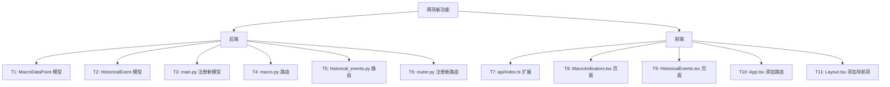
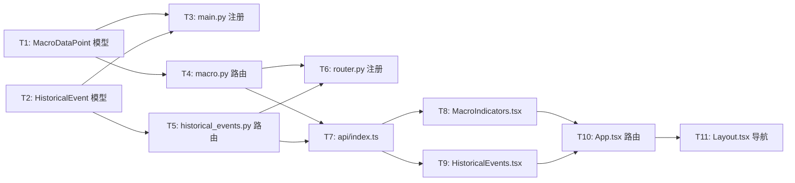

# 功能规划：宏观指标追踪 + 历史事件库

**规划时间**：2026-03-24
**预估工作量**：28 任务点

---

## 1. 功能概述

### 1.1 目标

- **宏观指标追踪（MacroIndicators）**：从 FRED（圣路易斯联储）免费 CSV 接口拉取 5 项关键宏观指标数据，存入本地 SQLite，在前端以卡片 + 折叠图表的方式展示，支持时间范围筛选。
- **历史事件库（HistoricalEvents）**：维护一个可增删、可分类的历史金融事件数据库，内置约 10 条重大事件（加锁不可删除），用户可自定义新增，前端支持分类过滤、全文搜索、详情展开、关键指标编辑器。

### 1.2 范围

**包含**：
- FRED 数据采集：M2SL / FEDFUNDS / CPIAUCSL / DGS10 / UNRATE（5 条序列）
- 数据持久化至 SQLite `macro_data_points` 表
- MoM（环比）变动计算（后端计算，前端直接读取）
- 前端时间范围筛选（3M/6M/1Y/3Y），不触发额外 API 请求
- "刷新数据"手动触发 FRED 采集
- 历史事件 CRUD（含内置事件锁定）
- Seed 端点导入 10 条内置事件
- 动态 KeyMetrics 编辑器（modal 中逐行添加/删除 label:value 对）

**不包含**：
- FRED API Key 认证（使用公开 CSV 端点，无需 Key）
- 宏观指标的 AI 分析/评分
- 历史事件与新闻文章的关联
- 定时自动刷新（V2.2 可扩展）

### 1.3 技术约束

- 后端：Python 3.11+，FastAPI 0.115，SQLAlchemy 2.0 async，httpx（已在 requirements.txt 中）
- 前端：React 19，TypeScript，TailwindCSS 4 CSS token，Recharts，lucide-react（TrendingUp / TrendingDown 图标）
- FRED CSV 端点：`https://fred.stlouisfed.org/graph/fredgraph.csv?id=<SERIES_ID>`，返回两列 `DATE,VALUE`，无认证
- CPI YoY 需要前端或后端从月度绝对值计算同比（后端计算，存储 yoy 值）
- 模型新增后须在 `app/main.py` 中 import（触发 `create_all`），并在 `init_db()` 中注册

---

## 2. WBS 任务分解

### 2.1 分解结构图



### 2.2 任务清单

---

#### 模块 A：后端数据模型（4 任务点）

---

##### T1：创建 MacroDataPoint ORM 模型（2 点）

**文件**：`backend/app/models/macro_indicator.py`（新建）

**输入**：无（新文件）
**输出**：`MacroDataPoint` SQLAlchemy 模型，对应 `macro_data_points` 表

**关键步骤**：

1. 参照 `bookmark.py` / `calendar_event.py` 的风格创建文件。
2. 定义如下字段：

```python
from datetime import date, datetime
from sqlalchemy import String, Float, Date, DateTime, Integer, Index, UniqueConstraint
from sqlalchemy.orm import Mapped, mapped_column
from app.database import Base


class MacroDataPoint(Base):
    __tablename__ = "macro_data_points"

    id: Mapped[int] = mapped_column(Integer, primary_key=True, autoincrement=True)
    # FRED series ID，例如 "M2SL"、"FEDFUNDS"
    series_id: Mapped[str] = mapped_column(String(20), nullable=False)
    # 数据点日期（FRED 返回月/周/日频，统一存 date）
    data_date: Mapped[date] = mapped_column(Date, nullable=False)
    # 原始值（FRED 返回 "." 表示缺失，存 None）
    value: Mapped[float | None] = mapped_column(Float, nullable=True)
    # 同比值（YoY %），仅 CPIAUCSL 序列需要；其他序列留 None
    yoy: Mapped[float | None] = mapped_column(Float, nullable=True)
    # 环比变动（MoM absolute diff）
    mom: Mapped[float | None] = mapped_column(Float, nullable=True)
    fetched_at: Mapped[datetime] = mapped_column(DateTime, default=datetime.utcnow)

    __table_args__ = (
        UniqueConstraint("series_id", "data_date", name="uq_macro_series_date"),
        Index("ix_macro_series_id", "series_id"),
        Index("ix_macro_data_date", "data_date"),
    )

    def to_dict(self) -> dict:
        return {
            "id": self.id,
            "series_id": self.series_id,
            "data_date": self.data_date.isoformat() if self.data_date else None,
            "value": self.value,
            "yoy": self.yoy,
            "mom": self.mom,
            "fetched_at": self.fetched_at.isoformat() if self.fetched_at else None,
        }
```

3. `UniqueConstraint("series_id", "data_date")` 确保 upsert 时不重复插入。

---

##### T2：创建 HistoricalEvent ORM 模型（2 点）

**文件**：`backend/app/models/historical_event.py`（新建）

**输入**：无（新文件）
**输出**：`HistoricalEvent` SQLAlchemy 模型，对应 `historical_events` 表

**关键步骤**：

1. 定义字段，`key_metrics` 使用 `JSONField`（list of `{"label": str, "value": str}`）：

```python
from datetime import datetime
from sqlalchemy import String, Text, Boolean, DateTime, Integer, Index
from sqlalchemy.orm import Mapped, mapped_column
from app.database import Base, JSONField


class HistoricalEvent(Base):
    __tablename__ = "historical_events"

    id: Mapped[int] = mapped_column(Integer, primary_key=True, autoincrement=True)
    title: Mapped[str] = mapped_column(String(200), nullable=False)
    # 分类：金融危机 / 货币政策 / 疫情冲击 / 科技泡沫 / 地缘政治
    category: Mapped[str] = mapped_column(String(50), nullable=False)
    # 时间范围，字符串形式，例如 "2008-09 ~ 2009-03"
    date_range: Mapped[str] = mapped_column(String(50), nullable=False)
    # bullish / bearish / mixed
    market_impact: Mapped[str] = mapped_column(String(20), nullable=False, default="mixed")
    description: Mapped[str | None] = mapped_column(Text, nullable=True)
    # [{"label": "标普500跌幅", "value": "-56.8%"}, ...]
    key_metrics: Mapped[list | None] = mapped_column(JSONField, nullable=True, default=list)
    # True = 内置事件，不可删除
    is_builtin: Mapped[bool] = mapped_column(Boolean, default=False)
    created_at: Mapped[datetime] = mapped_column(DateTime, default=datetime.utcnow)

    __table_args__ = (
        Index("ix_historical_event_category", "category"),
    )

    def to_dict(self) -> dict:
        return {
            "id": self.id,
            "title": self.title,
            "category": self.category,
            "date_range": self.date_range,
            "market_impact": self.market_impact,
            "description": self.description,
            "key_metrics": self.key_metrics or [],
            "is_builtin": self.is_builtin,
            "created_at": self.created_at.isoformat() if self.created_at else None,
        }
```

2. `is_builtin=True` 的记录在 DELETE 路由中拒绝操作。

---

#### 模块 B：main.py 注册新模型（1 任务点）

---

##### T3：在 main.py 中 import 两个新模型（1 点）

**文件**：`backend/app/main.py`（修改）

**输入**：T1、T2 完成后的两个模型文件
**输出**：`init_db()` 能创建 `macro_data_points` 和 `historical_events` 两张表

**关键步骤**：

在文件顶部现有 import 块（第 14-15 行附近）添加两行：

```python
from app.models.macro_indicator import MacroDataPoint  # noqa: F401
from app.models.historical_event import HistoricalEvent  # noqa: F401
```

注意：这两个 import 必须在 `await init_db()` 调用之前执行，但 `main.py` 中 `init_db()` 在 `lifespan` 内调用，模块级 import 已足够。与现有 `ArticleBookmark` / `CalendarEvent` 的注册方式完全相同（见第 14-15 行）。

---

#### 模块 C：Macro API 路由（6 任务点）

---

##### T4：创建 macro.py 路由（6 点）

**文件**：`backend/app/api/macro.py`（新建）

**输入**：`MacroDataPoint` 模型（T1），httpx（已在依赖中）
**输出**：
- `GET /api/macro/indicators` — 返回 5 个指标的最新值 + 近期历史数据
- `POST /api/macro/refresh` — 触发 FRED CSV 采集并存库

**关键步骤**：

**步骤 1**：定义 FRED 序列配置字典

```python
import csv
import io
import logging
from datetime import date, datetime
from typing import Optional

import httpx
from fastapi import APIRouter, Depends, HTTPException
from sqlalchemy import select, desc, delete
from sqlalchemy.ext.asyncio import AsyncSession

from app.auth import get_current_user
from app.database import get_session
from app.models.macro_indicator import MacroDataPoint

router = APIRouter()
logger = logging.getLogger(__name__)

FRED_SERIES = {
    "M2SL":      {"label": "M2 货币供应量",    "unit": "十亿美元", "freq": "monthly"},
    "FEDFUNDS":  {"label": "联邦基金利率",      "unit": "%",       "freq": "monthly"},
    "CPIAUCSL":  {"label": "CPI（同比）",       "unit": "%",       "freq": "monthly"},
    "DGS10":     {"label": "10年期美债收益率",   "unit": "%",       "freq": "daily"},
    "UNRATE":    {"label": "失业率",            "unit": "%",       "freq": "monthly"},
}
FRED_BASE = "https://fred.stlouisfed.org/graph/fredgraph.csv?id="
```

**步骤 2**：实现 `_fetch_and_store_series(series_id, session)` 内部异步函数

```python
async def _fetch_and_store_series(series_id: str, session: AsyncSession) -> int:
    """从 FRED 拉取 CSV，解析后 upsert 到 macro_data_points 表。返回新增/更新条数。"""
    url = f"{FRED_BASE}{series_id}"
    async with httpx.AsyncClient(timeout=30) as client:
        resp = await client.get(url)
        resp.raise_for_status()

    reader = csv.reader(io.StringIO(resp.text))
    rows = list(reader)
    # 第一行为表头 ["DATE", "VALUE"]，跳过
    data_rows = rows[1:]

    # 解析为 (date, value) 列表，过滤缺失值 "."
    parsed: list[tuple[date, float]] = []
    for row in data_rows:
        if len(row) < 2:
            continue
        date_str, val_str = row[0].strip(), row[1].strip()
        if val_str == ".":
            continue
        try:
            d = date.fromisoformat(date_str)
            v = float(val_str)
            parsed.append((d, v))
        except (ValueError, TypeError):
            continue

    if not parsed:
        return 0

    # 对 CPIAUCSL 计算 YoY（当月值 / 12个月前值 - 1）
    is_cpi = series_id == "CPIAUCSL"
    date_to_val = {d: v for d, v in parsed}

    upsert_count = 0
    for i, (d, v) in enumerate(parsed):
        # 计算 MoM（与上一数据点的绝对差）
        mom = round(v - parsed[i - 1][1], 4) if i > 0 else None

        # 计算 YoY（仅 CPI）
        yoy = None
        if is_cpi:
            from dateutil.relativedelta import relativedelta  # noqa
            # 尝试找 12 个月前的值
            prev_year_date = d.replace(year=d.year - 1)
            prev_val = date_to_val.get(prev_year_date)
            if prev_val and prev_val != 0:
                yoy = round((v / prev_val - 1) * 100, 2)

        # upsert：先查是否存在
        existing = (await session.execute(
            select(MacroDataPoint)
            .where(MacroDataPoint.series_id == series_id)
            .where(MacroDataPoint.data_date == d)
        )).scalar_one_or_none()

        if existing:
            existing.value = v
            existing.mom = mom
            existing.yoy = yoy
            existing.fetched_at = datetime.utcnow()
        else:
            dp = MacroDataPoint(
                series_id=series_id,
                data_date=d,
                value=v,
                mom=mom,
                yoy=yoy,
            )
            session.add(dp)
        upsert_count += 1

    await session.commit()
    return upsert_count
```

> **注意**：`dateutil` 已作为 `python-dateutil` 被 `apscheduler` 间接依赖，可直接使用。若不确定，可以用纯 Python 计算 12 个月前：`prev_year_date = d.replace(year=d.year - 1)` 即可（不需要 dateutil，因为 CPI 数据都是每月 1 日）。将 `dateutil` import 改为直接的 `d.replace(year=d.year - 1)` 更安全：

```python
# 计算 YoY（不依赖 dateutil）
yoy = None
if is_cpi:
    try:
        prev_year_date = d.replace(year=d.year - 1)
        prev_val = date_to_val.get(prev_year_date)
        if prev_val and prev_val != 0:
            yoy = round((v / prev_val - 1) * 100, 2)
    except ValueError:
        pass  # 2月29日 -> 上一年无此日期，跳过
```

**步骤 3**：实现 `GET /` 端点（返回各 series 最新值 + 历史数据列表）

```python
@router.get("/indicators")
async def get_indicators(
    session: AsyncSession = Depends(get_session),
    _=Depends(get_current_user),
):
    """
    返回所有 5 个指标的：
    - latest: 最新数据点
    - history: 近 5 年所有数据点（前端按时间范围过滤）
    """
    result = {}
    for series_id, meta in FRED_SERIES.items():
        # 查询近 5 年数据（最多约 60 个月度数据点，DGS10 约 1300 个日频点）
        # 为控制响应大小，日频序列（DGS10）限制取最近 400 条
        limit = 400 if meta["freq"] == "daily" else 120
        rows = (await session.execute(
            select(MacroDataPoint)
            .where(MacroDataPoint.series_id == series_id)
            .order_by(desc(MacroDataPoint.data_date))
            .limit(limit)
        )).scalars().all()

        rows_sorted = sorted(rows, key=lambda r: r.data_date)
        latest = rows_sorted[-1].to_dict() if rows_sorted else None

        result[series_id] = {
            "series_id": series_id,
            "label": meta["label"],
            "unit": meta["unit"],
            "freq": meta["freq"],
            "latest": latest,
            "history": [r.to_dict() for r in rows_sorted],
        }
    return result
```

**步骤 4**：实现 `POST /refresh` 端点

```python
@router.post("/refresh")
async def refresh_indicators(
    session: AsyncSession = Depends(get_session),
    _=Depends(get_current_user),
):
    """手动触发 FRED 数据拉取。逐个序列采集，返回每个序列的更新条数。"""
    results = {}
    errors = {}
    for series_id in FRED_SERIES:
        try:
            count = await _fetch_and_store_series(series_id, session)
            results[series_id] = count
            logger.info(f"FRED {series_id}: upserted {count} rows")
        except Exception as e:
            logger.error(f"FRED {series_id} fetch failed: {e}")
            errors[series_id] = str(e)

    return {"updated": results, "errors": errors}
```

---

#### 模块 D：Historical Events API 路由（5 任务点）

---

##### T5：创建 historical_events.py 路由（5 点）

**文件**：`backend/app/api/historical_events.py`（新建）

**输入**：`HistoricalEvent` 模型（T2）
**输出**：
- `GET /api/historical-events/` — 列表查询（支持 category 过滤和 search）
- `POST /api/historical-events/` — 创建自定义事件
- `DELETE /api/historical-events/{id}` — 删除（内置事件拒绝）
- `POST /api/historical-events/seed` — 导入内置事件

**关键步骤**：

**步骤 1**：定义内置事件数据（约 10 条）

```python
import logging
from typing import Optional

from fastapi import APIRouter, Depends, HTTPException, Query
from pydantic import BaseModel, Field
from sqlalchemy import select, or_
from sqlalchemy.ext.asyncio import AsyncSession

from app.auth import get_current_user
from app.database import get_session
from app.models.historical_event import HistoricalEvent

router = APIRouter()
logger = logging.getLogger(__name__)

_BUILTIN_EVENTS = [
    {
        "title": "2008年全球金融危机",
        "category": "金融危机",
        "date_range": "2007-08 ~ 2009-03",
        "market_impact": "bearish",
        "description": "美国次贷危机引发全球金融系统性崩溃。雷曼兄弟破产，多家大型金融机构被救助或并购，全球股市腰斩，信贷市场冻结。",
        "key_metrics": [
            {"label": "标普500跌幅", "value": "-56.8%"},
            {"label": "雷曼倒闭日期", "value": "2008-09-15"},
            {"label": "美联储降息幅度", "value": "500 bps"},
            {"label": "全球GDP损失", "value": "约2万亿美元"},
        ],
    },
    {
        "title": "2000年科技股泡沫破裂（互联网泡沫）",
        "category": "科技泡沫",
        "date_range": "2000-03 ~ 2002-10",
        "market_impact": "bearish",
        "description": "纳斯达克在2000年3月达到顶峰后崩溃，大量互联网公司倒闭，科技股市值蒸发约5万亿美元。",
        "key_metrics": [
            {"label": "纳斯达克跌幅", "value": "-78%"},
            {"label": "纳斯达克峰值", "value": "5048.62（2000-03-10）"},
            {"label": "泡沫历时", "value": "约30个月"},
        ],
    },
    {
        "title": "2020年新冠疫情冲击",
        "category": "疫情冲击",
        "date_range": "2020-02 ~ 2020-04",
        "market_impact": "bearish",
        "description": "COVID-19全球大流行引发史上最快熊市，标普500在33天内跌34%，随后美联储无限QE触发V形反弹。",
        "key_metrics": [
            {"label": "标普500最大跌幅", "value": "-34%（33天）"},
            {"label": "美联储降息", "value": "150 bps（3月）"},
            {"label": "财政刺激规模", "value": "2.2万亿美元（CARES法案）"},
            {"label": "VIX峰值", "value": "85.47"},
        ],
    },
    {
        "title": "1997年亚洲金融危机",
        "category": "金融危机",
        "date_range": "1997-07 ~ 1998-12",
        "market_impact": "bearish",
        "description": "泰铢崩溃引发连锁反应，波及韩国、印尼、马来西亚等亚洲经济体，IMF救助，多国货币大幅贬值。",
        "key_metrics": [
            {"label": "泰铢贬值幅度", "value": "-40%"},
            {"label": "韩元贬值幅度", "value": "-50%"},
            {"label": "IMF救助金额", "value": "1180亿美元"},
        ],
    },
    {
        "title": "2022年美联储激进加息周期",
        "category": "货币政策",
        "date_range": "2022-03 ~ 2023-07",
        "market_impact": "bearish",
        "description": "为应对40年最高通胀，美联储在16个月内连续加息11次，累计加息525 bps，联邦基金利率从0.25%升至5.5%，引发股债双杀。",
        "key_metrics": [
            {"label": "累计加息幅度", "value": "525 bps"},
            {"label": "加息次数", "value": "11次"},
            {"label": "标普500 2022年跌幅", "value": "-19.4%"},
            {"label": "10年美债收益率峰值", "value": "5.0%（2023-10）"},
        ],
    },
    {
        "title": "2008年量化宽松（QE1）",
        "category": "货币政策",
        "date_range": "2008-11 ~ 2010-03",
        "market_impact": "bullish",
        "description": "美联储首次实施量化宽松，购买MBS和国债共1.75万亿美元，开创现代央行资产负债表扩张先例，推动市场从底部反弹。",
        "key_metrics": [
            {"label": "QE1规模", "value": "1.75万亿美元"},
            {"label": "美联储资产负债表扩张", "value": "900B → 2.3T"},
            {"label": "标普500从底部涨幅", "value": "+67%（12个月）"},
        ],
    },
    {
        "title": "2011年欧债危机",
        "category": "金融危机",
        "date_range": "2010-01 ~ 2012-09",
        "market_impact": "bearish",
        "description": "希腊、意大利、西班牙等国主权债务危机，欧元区面临解体风险，ECB推出OMT计划后危机平息。",
        "key_metrics": [
            {"label": "希腊10年债收益率峰值", "value": "35%"},
            {"label": "欧元兑美元跌幅", "value": "-20%"},
            {"label": "ECB OMT宣布日期", "value": "2012-09-06"},
        ],
    },
    {
        "title": "2022年俄乌战争爆发",
        "category": "地缘政治",
        "date_range": "2022-02 ~ 至今",
        "market_impact": "mixed",
        "description": "俄罗斯全面入侵乌克兰，引发能源危机，欧洲天然气价格飙升，全球供应链受冲击，西方制裁重塑全球大宗商品格局。",
        "key_metrics": [
            {"label": "欧洲天然气峰值涨幅", "value": "+800%"},
            {"label": "布伦特原油峰值", "value": "128美元/桶"},
            {"label": "卢布最大贬值幅度", "value": "-50%（短暂）"},
        ],
    },
    {
        "title": "1987年黑色星期一",
        "category": "金融危机",
        "date_range": "1987-10-19",
        "market_impact": "bearish",
        "description": "道琼斯工业平均指数单日暴跌22.6%，创史上最大单日跌幅，触发全球股市连锁暴跌，程序化交易是主要推手。",
        "key_metrics": [
            {"label": "道指单日跌幅", "value": "-22.6%"},
            {"label": "市值蒸发", "value": "约5000亿美元"},
            {"label": "VIX概念前身波动率", "value": "极端高位"},
        ],
    },
    {
        "title": "2021年加密货币牛市与崩盘",
        "category": "科技泡沫",
        "date_range": "2020-10 ~ 2022-06",
        "market_impact": "mixed",
        "description": "比特币从1万美元涨至6.9万美元历史高位，随后跌至1.6万美元，Terra/Luna崩盘和FTX破产加速熊市。",
        "key_metrics": [
            {"label": "BTC峰值", "value": "69,000美元（2021-11）"},
            {"label": "BTC最大回撤", "value": "-77%"},
            {"label": "加密总市值蒸发", "value": "约2万亿美元"},
        ],
    },
]
```

**步骤 2**：定义 Pydantic 请求体模型

```python
class KeyMetric(BaseModel):
    label: str = Field(..., max_length=100)
    value: str = Field(..., max_length=200)


class EventCreate(BaseModel):
    title: str = Field(..., max_length=200)
    category: str = Field(..., max_length=50)
    date_range: str = Field(..., max_length=50)
    market_impact: str = Field(default="mixed")
    description: Optional[str] = None
    key_metrics: Optional[list[KeyMetric]] = None
```

**步骤 3**：实现 `GET /` 端点

```python
@router.get("/")
async def list_events(
    category: Optional[str] = None,
    search: Optional[str] = Query(None, max_length=100),
    session: AsyncSession = Depends(get_session),
    _=Depends(get_current_user),
):
    query = select(HistoricalEvent).order_by(HistoricalEvent.is_builtin.desc(), HistoricalEvent.id.desc())
    if category:
        query = query.where(HistoricalEvent.category == category)
    if search:
        pattern = f"%{search}%"
        query = query.where(
            or_(
                HistoricalEvent.title.ilike(pattern),
                HistoricalEvent.description.ilike(pattern),
            )
        )
    result = await session.execute(query)
    return [e.to_dict() for e in result.scalars().all()]
```

**步骤 4**：实现 `POST /`、`DELETE /{id}`、`POST /seed` 端点

```python
VALID_CATEGORIES = ["金融危机", "货币政策", "疫情冲击", "科技泡沫", "地缘政治"]
VALID_IMPACTS = ["bullish", "bearish", "mixed"]


@router.post("/", status_code=201)
async def create_event(
    body: EventCreate,
    session: AsyncSession = Depends(get_session),
    _=Depends(get_current_user),
):
    if body.category not in VALID_CATEGORIES:
        raise HTTPException(status_code=400, detail=f"category 必须是: {', '.join(VALID_CATEGORIES)}")
    if body.market_impact not in VALID_IMPACTS:
        raise HTTPException(status_code=400, detail=f"market_impact 必须是: {', '.join(VALID_IMPACTS)}")

    event = HistoricalEvent(
        title=body.title,
        category=body.category,
        date_range=body.date_range,
        market_impact=body.market_impact,
        description=body.description,
        key_metrics=[m.model_dump() for m in body.key_metrics] if body.key_metrics else [],
        is_builtin=False,
    )
    session.add(event)
    await session.commit()
    await session.refresh(event)
    return event.to_dict()


@router.delete("/{event_id}", status_code=204)
async def delete_event(
    event_id: int,
    session: AsyncSession = Depends(get_session),
    _=Depends(get_current_user),
):
    ev = (await session.execute(
        select(HistoricalEvent).where(HistoricalEvent.id == event_id)
    )).scalar_one_or_none()
    if not ev:
        raise HTTPException(status_code=404, detail="事件不存在")
    if ev.is_builtin:
        raise HTTPException(status_code=403, detail="内置事件不可删除")
    await session.delete(ev)
    await session.commit()


@router.post("/seed")
async def seed_builtin_events(
    session: AsyncSession = Depends(get_session),
    _=Depends(get_current_user),
):
    """导入内置历史事件（已存在的跳过，按 title + category 去重）。"""
    added = 0
    for item in _BUILTIN_EVENTS:
        existing = (await session.execute(
            select(HistoricalEvent)
            .where(HistoricalEvent.title == item["title"])
            .where(HistoricalEvent.is_builtin == True)  # noqa: E712
        )).scalar_one_or_none()
        if existing:
            continue
        ev = HistoricalEvent(
            title=item["title"],
            category=item["category"],
            date_range=item["date_range"],
            market_impact=item["market_impact"],
            description=item.get("description"),
            key_metrics=item.get("key_metrics", []),
            is_builtin=True,
        )
        session.add(ev)
        added += 1
    await session.commit()
    return {"added": added, "total_builtin": len(_BUILTIN_EVENTS)}
```

---

#### 模块 E：路由注册（1 任务点）

---

##### T6：在 router.py 中注册两个新路由（1 点）

**文件**：`backend/app/api/router.py`（修改）

**输入**：T4 / T5 创建的路由文件
**输出**：`/api/macro` 和 `/api/historical-events` 生效

**关键步骤**：

在第 3 行的 import 中追加两个新模块，在末尾追加两行 `include_router`：

```python
# 修改后的完整文件
from fastapi import APIRouter

from app.api import auth_routes, articles, bookmarks, dashboard, settings, reports, alerts, skills, ws, twitter, calendar
from app.api import macro, historical_events  # 新增

api_router = APIRouter(prefix="/api")
api_router.include_router(auth_routes.router, prefix="/auth", tags=["Auth"])
api_router.include_router(articles.router, prefix="/articles", tags=["Articles"])
api_router.include_router(bookmarks.router, prefix="/bookmarks", tags=["Bookmarks"])
api_router.include_router(dashboard.router, prefix="/dashboard", tags=["Dashboard"])
api_router.include_router(settings.router, prefix="/settings", tags=["Settings"])
api_router.include_router(reports.router, prefix="/reports", tags=["Reports"])
api_router.include_router(alerts.router, prefix="/alerts", tags=["Alerts"])
api_router.include_router(skills.router, prefix="/skills", tags=["Skills"])
api_router.include_router(twitter.router, prefix="/twitter", tags=["Twitter"])
api_router.include_router(calendar.router, prefix="/calendar", tags=["Calendar"])
api_router.include_router(macro.router, prefix="/macro", tags=["Macro"])                          # 新增
api_router.include_router(historical_events.router, prefix="/historical-events", tags=["HistoricalEvents"])  # 新增
api_router.include_router(ws.router, tags=["WebSocket"])
```

---

#### 模块 F：前端 API 客户端扩展（1 任务点）

---

##### T7：在 api/index.ts 中添加两个 API 模块（1 点）

**文件**：`frontend/src/api/index.ts`（修改）

**输入**：T4、T5 的接口设计
**输出**：`macroApi` 和 `historicalEventsApi` 两个导出模块

**关键步骤**：

在文件末尾（`bookmarksApi` 之后）追加：

```typescript
export const macroApi = {
  getIndicators: () => client.get('/macro/indicators'),
  refresh: () => client.post('/macro/refresh'),
}

export const historicalEventsApi = {
  list: (params: { category?: string; search?: string } = {}) =>
    client.get('/historical-events/', { params }),
  create: (data: {
    title: string
    category: string
    date_range: string
    market_impact: string
    description?: string
    key_metrics?: Array<{ label: string; value: string }>
  }) => client.post('/historical-events/', data),
  remove: (id: number) => client.delete(`/historical-events/${id}`),
  seed: () => client.post('/historical-events/seed'),
}
```

---

#### 模块 G：MacroIndicators 前端页面（7 任务点）

---

##### T8：创建 MacroIndicators.tsx（7 点）

**文件**：`frontend/src/pages/MacroIndicators.tsx`（新建）

**输入**：`macroApi`（T7），Recharts，lucide-react
**输出**：完整的宏观指标追踪页面

**TypeScript 接口定义**（文件顶部）：

```typescript
interface MacroDataPoint {
  id: number
  series_id: string
  data_date: string       // "YYYY-MM-DD"
  value: number | null
  yoy: number | null      // 仅 CPIAUCSL 有效
  mom: number | null      // 环比绝对变动
  fetched_at: string
}

interface IndicatorData {
  series_id: string
  label: string
  unit: string
  freq: 'monthly' | 'daily'
  latest: MacroDataPoint | null
  history: MacroDataPoint[]
}

type TimeRange = '3M' | '6M' | '1Y' | '3Y'
```

**关键状态变量**：

```typescript
const [indicators, setIndicators] = useState<Record<string, IndicatorData>>({})
const [loading, setLoading] = useState(true)
const [refreshing, setRefreshing] = useState(false)
const [expandedCards, setExpandedCards] = useState<Set<string>>(new Set())
const [timeRanges, setTimeRanges] = useState<Record<string, TimeRange>>({}) // 每个卡片独立时间范围
```

**关键步骤**：

**步骤 1**：`fetchData()` 函数，调用 `macroApi.getIndicators()`，`setIndicators(resp.data)`

**步骤 2**：`handleRefresh()` 函数，调用 `macroApi.refresh()`，然后重新 `fetchData()`

**步骤 3**：`filterHistory(history, range)` 前端纯函数，根据 `TimeRange` 过滤数据点（不触发 API）

```typescript
function filterHistory(history: MacroDataPoint[], range: TimeRange): MacroDataPoint[] {
  const now = new Date()
  const monthsMap: Record<TimeRange, number> = { '3M': 3, '6M': 6, '1Y': 12, '3Y': 36 }
  const cutoff = new Date(now)
  cutoff.setMonth(cutoff.getMonth() - monthsMap[range])
  return history.filter(d => new Date(d.data_date) >= cutoff)
}
```

**步骤 4**：`IndicatorCard` 子组件（可定义为内部函数组件）

```
IndicatorCard
├── 卡片头部
│   ├── 标题（label）
│   ├── 最新值 + 单位（大字号）
│   ├── MoM 变动 badge（+ 绿色 / - 红色 / 无色）
│   │   对于 CPIAUCSL 显示 yoy 代替 mom（标注"同比"）
│   ├── 趋势箭头（TrendingUp / TrendingDown / Minus）
│   └── 展开/收起按钮（ChevronDown / ChevronUp）
└── 折叠区域（仅 expandedCards.has(series_id) 时渲染）
    ├── 时间范围 Tab (3M / 6M / 1Y / 3Y)
    └── Recharts LineChart
        ├── XAxis: dataKey="data_date"，tickFormatter 截取 YYYY-MM
        ├── YAxis: 自动域
        ├── Tooltip: 显示完整日期 + 值 + 单位
        └── Line: strokeWidth=2，dot={false}，color="var(--color-primary)"
```

**步骤 5**：图表数据准备

```typescript
// 对于 CPIAUCSL，Y 轴显示 yoy（同比）；其他显示 value
const chartData = filteredHistory.map(d => ({
  date: d.data_date,
  value: series_id === 'CPIAUCSL' ? d.yoy : d.value,
})).filter(d => d.value !== null)
```

**步骤 6**：页面布局

```
MacroIndicators
├── 页面标题 + "刷新数据" 按钮（RefreshCw icon，loading 时 spin）
├── 加载 skeleton（loading 时）
└── 5个 IndicatorCard 网格（grid grid-cols-1 md:grid-cols-2 xl:grid-cols-3）
    CPI 卡片宽度可 col-span-1，不需要特殊处理
```

**步骤 7**：空数据引导

若 `indicators` 为空对象（首次加载、FRED 未采集），显示提示卡：
```
"暂无数据，点击「刷新数据」从 FRED 采集宏观指标"
```

---

#### 模块 H：HistoricalEvents 前端页面（6 任务点）

---

##### T9：创建 HistoricalEvents.tsx（6 点）

**文件**：`frontend/src/pages/HistoricalEvents.tsx`（新建）

**输入**：`historicalEventsApi`（T7），lucide-react
**输出**：完整的历史事件库页面

**TypeScript 接口定义**（文件顶部）：

```typescript
interface KeyMetric {
  label: string
  value: string
}

interface HistoricalEvent {
  id: number
  title: string
  category: string        // "金融危机" | "货币政策" | "疫情冲击" | "科技泡沫" | "地缘政治"
  date_range: string
  market_impact: string   // "bullish" | "bearish" | "mixed"
  description: string | null
  key_metrics: KeyMetric[]
  is_builtin: boolean
  created_at: string
}

interface EventFormData {
  title: string
  category: string
  date_range: string
  market_impact: string
  description: string
  key_metrics: KeyMetric[]
}
```

**关键状态变量**：

```typescript
const [events, setEvents] = useState<HistoricalEvent[]>([])
const [loading, setLoading] = useState(true)
const [categoryFilter, setCategoryFilter] = useState<string>('')      // '' = 全部
const [searchQuery, setSearchQuery] = useState('')
const [expandedIds, setExpandedIds] = useState<Set<number>>(new Set())
const [showAddModal, setShowAddModal] = useState(false)
const [seeding, setSeeding] = useState(false)
// 表单状态（在 modal 内）
const [form, setForm] = useState<EventFormData>(emptyForm)
const [saving, setSaving] = useState(false)
```

**关键步骤**：

**步骤 1**：`fetchEvents(category?, search?)` 函数，调用 `historicalEventsApi.list()`

**步骤 2**：分类 filter chips 渲染

```
const CATEGORIES = ['金融危机', '货币政策', '疫情冲击', '科技泡沫', '地缘政治']

// 渲染：全部 chip + 5个分类 chip
// 点击切换 categoryFilter，chip 高亮当前选中项
// onChange 时调用 fetchEvents(newCategory, searchQuery)
```

**步骤 3**：搜索框，`onKeyDown Enter` 或防抖（300ms）触发 `fetchEvents`

**步骤 4**：`EventCard` 渲染（列表内联）

```
EventCard（border-border rounded-lg bg-card）
├── 卡片头（点击切换展开/收起）
│   ├── 标题 + Lock icon（is_builtin 时显示，使用 lucide Lock，size=14，text-text-secondary）
│   ├── 分类 badge（不同颜色，见下方配色方案）
│   ├── 时间范围（text-text-secondary text-sm）
│   ├── market_impact badge（bullish=绿/bearish=红/mixed=橙）
│   └── 右侧：Trash2 按钮（非内置）+ ChevronDown/Up
└── 展开区域（expandedIds.has(id)）
    ├── description 段落（text-text-secondary）
    └── key_metrics 网格（grid grid-cols-2 md:grid-cols-3 gap-3）
        每格：label（text-xs text-text-secondary）+ value（font-semibold）
```

**分类 badge 配色方案**（TailwindCSS token）：
```typescript
const categoryColors: Record<string, string> = {
  '金融危机': 'bg-red-100 text-red-700 dark:bg-red-900/30 dark:text-red-400',
  '货币政策': 'bg-blue-100 text-blue-700 dark:bg-blue-900/30 dark:text-blue-400',
  '疫情冲击': 'bg-purple-100 text-purple-700 dark:bg-purple-900/30 dark:text-purple-400',
  '科技泡沫': 'bg-yellow-100 text-yellow-700 dark:bg-yellow-900/30 dark:text-yellow-400',
  '地缘政治': 'bg-orange-100 text-orange-700 dark:bg-orange-900/30 dark:text-orange-400',
}
```

**步骤 5**：删除事件处理

```typescript
const handleDelete = async (id: number) => {
  if (!window.confirm('确认删除此事件？')) return
  await historicalEventsApi.remove(id)
  setEvents(prev => prev.filter(e => e.id !== id))
}
```

**步骤 6**：Add Event Modal

```
Modal（fixed inset-0 bg-black/50 z-50，点击遮罩关闭）
├── 标题：新增历史事件
├── 表单字段：
│   ├── 事件标题（input）
│   ├── 分类（select，从 CATEGORIES 生成 option）
│   ├── 时间范围（input，placeholder="2008-09 ~ 2009-03"）
│   ├── 市场影响（select：看多/看空/中性）
│   ├── 事件描述（textarea，rows=3）
│   └── 关键指标（KeyMetricsEditor，见步骤 7）
└── 底部按钮：取消 / 保存
```

**步骤 7**：`KeyMetricsEditor` 内联子组件

```typescript
// Props: metrics: KeyMetric[], onChange: (metrics: KeyMetric[]) => void
// 渲染已有指标行（label input + value input + 删除按钮）
// "添加指标"按钮（Plus icon）追加空行
// 注意：最多 10 条（前端校验）
```

**步骤 8**：Seed 按钮（在页面标题旁）

```typescript
const handleSeed = async () => {
  setSeeding(true)
  const resp = await historicalEventsApi.seed()
  // 显示 "已导入 X 条内置事件" toast 或 alert
  await fetchEvents()
  setSeeding(false)
}
```

**步骤 9**：`handleSubmit()` 提交表单

```typescript
const handleSubmit = async () => {
  if (!form.title.trim() || !form.category || !form.date_range.trim()) {
    alert('请填写必填字段')
    return
  }
  setSaving(true)
  try {
    await historicalEventsApi.create({
      ...form,
      key_metrics: form.key_metrics.filter(m => m.label && m.value),
    })
    setShowAddModal(false)
    setForm(emptyForm)
    await fetchEvents()
  } finally {
    setSaving(false)
  }
}
```

---

#### 模块 I：路由与导航（1 任务点）

---

##### T10：在 App.tsx 中添加两条路由（0.5 点）

**文件**：`frontend/src/App.tsx`（修改）

**关键步骤**：

1. 在顶部 import 区追加：
```typescript
import MacroIndicators from '@/pages/MacroIndicators'
import HistoricalEvents from '@/pages/HistoricalEvents'
```

2. 在 `<Route path="/calendar">` 之后追加（保持在 ProtectedRoute 内）：
```tsx
<Route path="/macro" element={<MacroIndicators />} />
<Route path="/historical-events" element={<HistoricalEvents />} />
```

---

##### T11：在 Layout.tsx 中添加两个导航项（0.5 点）

**文件**：`frontend/src/components/Layout.tsx`（修改）

**关键步骤**：

1. 在 import 语句中添加两个 lucide 图标（`TrendingUp`, `TrendingDown` 已在 lucide-react 中）：

将第 4 行 import 中添加 `TrendingUp, TrendingDown`：

```typescript
import {
  LayoutDashboard, Newspaper, FileText, AlertTriangle, Cpu,
  Settings, LogOut, Moon, Sun, Monitor, Menu, X, AtSign, Bookmark, CalendarDays,
  TrendingUp, TrendingDown,  // 新增
} from 'lucide-react'
```

2. 在 `navItems` 数组中，在 `CalendarDays` 条目后、`AtSign` 条目前插入两项：

```typescript
{ to: '/macro', icon: TrendingUp, label: '宏观指标' },
{ to: '/historical-events', icon: TrendingDown, label: '历史事件库' },
```

---

## 3. 依赖关系

### 3.1 依赖图



### 3.2 依赖说明

| 任务 | 依赖于 | 原因 |
|------|--------|------|
| T3 | T1, T2 | 模型文件需存在才能 import |
| T4 | T1 | 路由使用 MacroDataPoint 查询 |
| T5 | T2 | 路由使用 HistoricalEvent 查询 |
| T6 | T4, T5 | 路由文件需存在才能 import |
| T7 | T4, T5（接口设计定稿）| 前端 API 模块依赖后端接口结构 |
| T8 | T7 | 页面调用 macroApi |
| T9 | T7 | 页面调用 historicalEventsApi |
| T10 | T8, T9 | 需要页面组件存在才能 import |
| T11 | T10 | 可与 T10 同步进行，无硬依赖 |

### 3.3 并行任务

以下任务可以并行开发（在各自依赖满足后）：

- T1 ∥ T2（两个模型文件完全独立）
- T4 ∥ T5（两个路由文件完全独立，仅共享 `get_session` / `get_current_user`）
- T8 ∥ T9（两个页面完全独立，T7 完成后可同时开发）
- T10 ∥ T11（App.tsx 路由和 Layout.tsx 导航无相互依赖）

---

## 4. 实施建议

### 4.1 技术选型

| 需求 | 推荐方案 | 理由 |
|------|----------|------|
| FRED 数据拉取 | httpx AsyncClient（已有） | 项目已依赖，无需新增包 |
| CPI YoY 计算 | 后端纯 Python `date.replace(year=d.year-1)` | 避免引入 dateutil 依赖，CPI 数据固定每月第一天 |
| 前端图表 | Recharts LineChart（已有） | Dashboard 已使用，无需引入新图表库 |
| 折叠交互 | 本地 `useState<Set<string>>` | 无需动画库，CSS transition 即可 |
| Modal | 内联 JSX + fixed overlay | 项目无 Modal 组件库，与 Bookmarks 页面的 inline edit 方式保持一致 |

### 4.2 潜在风险

| 风险 | 影响 | 缓解措施 |
|------|------|----------|
| FRED CSV 接口网络超时 | 中 | `httpx.AsyncClient(timeout=30)`；`/refresh` 端点逐个序列 try/except，部分失败不影响其他 |
| DGS10 为日频数据（400条）响应较大 | 低 | 后端限制 `limit=400`，前端 `filterHistory` 过滤后 Recharts 实际渲染点数远小于此 |
| CPIAUCSL YoY 首年数据无法计算（缺去年同期） | 低 | `prev_val` 为 None 时 yoy 存 None，前端显示"—" |
| SQLite 并发写入（manual refresh 与 scheduler 同时运行） | 低 | SQLite WAL 模式已由 aiosqlite 启用，短暂锁等待即可；refresh 是低频操作 |
| 内置事件重复 seed | 低 | `seed` 端点按 `title + is_builtin=True` 去重，幂等设计 |
| 前端时区问题（FRED 返回 UTC 日期，前端 new Date() 可能偏移） | 低 | 图表 XAxis 使用 `d.data_date.slice(0, 7)` 直接截取字符串，不做 Date 对象转换 |

### 4.3 测试策略

- **后端手动验证**：
  1. 启动服务后，先 `POST /api/macro/refresh`（预计 5-15 秒），再 `GET /api/macro/indicators`，检查每个 series 的 `history` 非空
  2. `POST /api/historical-events/seed`，验证返回 `{"added": 10, "total_builtin": 10}`
  3. `GET /api/historical-events/`，验证返回 10 条事件
  4. 尝试 `DELETE /api/historical-events/1`（内置事件），应返回 403
  5. 访问 Swagger：`http://127.0.0.1:8000/docs`，测试所有端点

- **前端手动验证**：
  1. 访问 `/macro`，点击"刷新数据"，等待 loading 结束后检查 5 张卡片数据
  2. 展开任意卡片，切换 3M/6M/1Y/3Y 时间范围，验证图表数据点变化（无 loading）
  3. 访问 `/historical-events`，点击"导入内置事件"，检查 10 条事件渲染
  4. 点击分类 chip 过滤，点击搜索框输入关键词
  5. 展开事件详情，检查 key_metrics 网格
  6. 新增自定义事件（含 KeyMetrics 多行），验证出现在列表顶部
  7. 删除自定义事件，验证从列表中移除；尝试删除内置事件（Lock 图标），确认 UI 不显示 Trash2 按钮

---

## 5. 验收标准

功能完成需满足以下条件：

- [ ] `GET /api/macro/indicators` 返回 5 个 series 的数据，历史点非空（需先 refresh）
- [ ] `POST /api/macro/refresh` 成功从 FRED 拉取数据，返回每个 series 的 upsert 条数
- [ ] `GET /api/historical-events/` 支持 category 过滤和 search
- [ ] `POST /api/historical-events/seed` 幂等导入 10 条内置事件
- [ ] `DELETE /api/historical-events/{id}` 对内置事件返回 403
- [ ] 前端 `/macro` 页面：5 张指标卡片展示正确，折叠图表时间范围筛选生效
- [ ] 前端 `/historical-events` 页面：分类过滤、搜索、展开详情、新增、删除全部功能正常
- [ ] 内置事件显示 Lock 图标，不显示 Trash2 删除按钮
- [ ] 新功能不破坏现有路由和页面
- [ ] 代码审查通过，无 TypeScript 编译错误（`pnpm build` 成功）

---

## 6. 后续优化方向

- **V2.2 定时自动刷新宏观数据**：在 `scheduler.py` 中新增 `fetch_macro` 任务（每日 UTC 06:00），调用 `_fetch_and_store_series` 逐个序列更新
- **V2.2 更多 FRED 序列**：PCE、VIX（VIXCLS）、ISM制造业PMI（MANEMP）等
- **V2.2 历史事件与新闻关联**：`HistoricalEvent` 增加 `related_article_ids` JSONField，在新闻详情中显示"相关历史事件"
- **V2.3 宏观指标趋势 AI 分析**：在 Skills 引擎中新增 Skill，对宏观数据偏离历史均值时触发 Alert
- **V2.3 历史事件 AI 相似度匹配**：用向量语义搜索在新闻采集时自动匹配历史事件，生成"历史类比"提示
