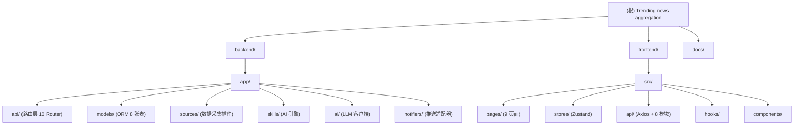

# CLAUDE.md

## 变更记录 (Changelog)

| 日期 | 版本 | 变更说明 |
|---|---|---|
| 2026-03-23 | v2.1 | 全量扫描更新：补充 Twitter 追踪、书签模块；AI 多服务商（含 Anthropic 格式）；Scheduler 更新为 8 个任务；DB 更新为 8 张表；新增模块结构图和子模块 CLAUDE.md |

---

## 项目愿景

投研 Agent — AI 驱动的金融新闻聚合与投研系统。全栈 SPA，Python FastAPI 后端 + React TypeScript 前端。从 14+ 数据源（RSS、CoinGecko、NewsAPI、Twitter/X via twikit）采集新闻，通过 LLM 批量评分（10 条/调用），生成每日早晚市场报告，并经 Telegram / 微信 PushPlus / QQ Qmsg 推送告警。系统内置 7 个专业 AI Skills（重要度评分、异常预警、日报生成、市场情绪监控、宏观流动性监控、价值投资框架、加密抄底模型）。

---

## 架构总览

```
Frontend (React 19 SPA + Vite 7)  ──REST/WebSocket──>  Backend (FastAPI 0.115 + Uvicorn)
                                                                │
                                                      ┌─────────┼──────────┐
                                                      │         │          │
                                                 Sources     Skills    Notifiers
                                               (RSS/API/    (LLM AI)  (TG/WeChat
                                                Twitter)              /QQ)
                                                      │         │          │
                                                      └────> SQLite <──────┘
                                                          (aiosqlite 8 tables)
```

### 三层 Agent 架构

1. **Knowledge Base（Sources）**: RSS feeds（14 路：新浪财经、华尔街见闻、36氪、金十数据、东方财富、FT中文、CoinDesk、Reuters、CNBC、Bloomberg、TechCrunch、The Block、SEC Filings、Hacker News）、CoinGecko 加密行情、NewsAPI（可选）、Twitter/X via twikit（可选）
2. **Skills（AI Engine）**: LLM 批量评分（BATCH_SIZE=10，每批一次 API 调用，减少约 80% token 消耗）、异常检测（importance >= 4 触发告警）、日报生成（Markdown 格式）；支持 OpenAI / DeepSeek / Gemini / OpenRouter / DashScope / MiniMax 6 家服务商预设；同时兼容 OpenAI 格式和 Anthropic Messages API 格式
3. **CRON（Scheduler）**: APScheduler AsyncIOScheduler，8 个定时任务

| Job ID | 触发方式 | 职责 |
|---|---|---|
| `fetch_news` | 每 15min | 采集所有启用数据源，新文章触发评分 |
| `push_important` | 每 5min | 推送 importance >= 3 的未推送文章 |
| `push_digest` | 每 30min | 推送摘要（最近 30min 内未推送文章） |
| `anomaly_check` | 每 10min | 检测近 1h 内 importance >= 4 的文章，生成 Alert |
| `morning_report` | 07:30 cron | 生成早间市场日报（24h 文章）|
| `evening_report` | 22:00 cron | 生成晚间市场日报（12h 文章）|
| `cleanup` | 03:00 cron | 清理 30 天前的旧文章 |
| `fetch_twitter` | 每 30min | 采集配置的 Twitter 博主推文 |

### Auth 流程

`POST /api/auth/login` → JWT (HS256, 7 天有效) → Zustand persist (localStorage: `news-agent-auth`) → Axios 请求拦截注入 `Authorization: Bearer <token>` → 401 自动 logout + 跳转 /login

### WebSocket

`ws[s]://<host>/api/ws/news` (endpoint: `/api/ws/news`) — 后端广播 `new_article` / `new_alert` 事件；前端 `useNewsSocket` hook 自动重连（5s delay）

---

## 模块结构图



---

## 模块索引

| 模块路径 | 语言 | 职责概述 |
|---|---|---|
| `backend/` | Python 3.11+ | FastAPI 后端全部逻辑 |
| `backend/app/api/` | Python | 10 个路由：auth、articles、bookmarks、dashboard、reports、alerts、skills、settings、twitter、ws |
| `backend/app/models/` | Python | SQLAlchemy 2.0 ORM，8 张表 |
| `backend/app/sources/` | Python | 新闻采集插件：RSS(14路)、CoinGecko、NewsAPI、Twitter |
| `backend/app/skills/` | Python | LLM 批量评分、日报生成、异常检测 |
| `backend/app/ai/` | Python | 双格式 LLM 客户端（OpenAI + Anthropic），6 服务商预设 |
| `backend/app/notifiers/` | Python | Telegram、WeChat(PushPlus)、QQ(Qmsg) 推送适配器 |
| `frontend/` | TypeScript/React 19 | Vite 7 SPA，8 个保护页面 |
| `frontend/src/pages/` | TSX | Dashboard、NewsFeed、Bookmarks、Reports、Alerts、Skills、TwitterTracking、Settings、Login |
| `frontend/src/stores/` | TS | auth（JWT 持久化）、theme（light/dark/system） |
| `frontend/src/api/` | TS | Axios 实例 + 8 个 API 模块 |
| `frontend/src/hooks/` | TS | `useNewsSocket` WebSocket 自动重连 hook |

---

## 运行与开发

### 一键启停

```bash
./start.sh   # 创建 venv、安装依赖、启动后端 :8000 + 前端 :5173（Ctrl+C 停止）
./stop.sh    # 停止所有服务（通过 .pids 文件）
```

### 手动启动后端

```bash
cd backend
python3 -m venv venv && source venv/bin/activate
pip install -r requirements.txt
uvicorn app.main:app --host 127.0.0.1 --port 8000
```

### 手动启动前端

```bash
cd frontend
pnpm install
pnpm dev      # http://localhost:5173
pnpm build    # 生产构建到 dist/
pnpm lint     # ESLint 检查
pnpm preview  # 预览生产构建
```

### 访问地址

| 服务 | 地址 |
|---|---|
| 前端 SPA | http://localhost:5173 |
| 后端 API | http://127.0.0.1:8000 |
| Swagger 文档 | http://127.0.0.1:8000/docs |
| 健康检查 | http://127.0.0.1:8000/health |
| 默认账号 | admin / admin123 |

---

## 测试策略

**当前状态**：项目尚无自动化测试（无 `tests/` 目录，无 `*.test.ts` 文件）。`backend/test_twikit.py` 已在 `.gitignore` 中排除，仅为本地手动验证脚本。

**建议补充**：
- 后端：pytest + pytest-asyncio；优先覆盖 `skills/engine.py`（批量评分逻辑）、`api/bookmarks.py`（边界校验：MAX_TAGS、MAX_NOTE_LENGTH）
- 前端：Vitest + React Testing Library；优先覆盖 `stores/auth.ts` 和 `api/index.ts`

---

## 编码规范

### 后端

- **异步优先**：所有 I/O（DB、HTTP）均使用 async/await；SQLAlchemy 2.0 异步风格，`Mapped[]` 类型注解
- **插件模式**：Sources 继承 `NewsSource`（`fetch() -> list[NewsItem]`），Notifiers 继承 `Notifier`（`send()` / `send_markdown()`）
- **Skills as config**：AI Skills 以 JSON 配置存储于 `skills` 表，7 个内置 Skill 在 `main.py lifespan` 中初始化
- **配置优先级**：DB `system_settings` 表 > `.env` 文件 > `config.py` 默认值
- **自定义 JSONField**：SQLite 不原生支持 JSON，使用 `database.py` 中的 `JSONField(TypeDecorator)` 透明序列化/反序列化

### 前端

- **状态管理**：Zustand（非 Redux），functional components + hooks
- **样式**：TailwindCSS 4，使用 CSS 变量主题（bg-sidebar、bg-primary 等自定义 token）
- **图表**：Recharts
- **Markdown 渲染**：react-markdown + remark-gfm（AI 日报页面）
- **路径别名**：`@/` 映射到 `src/`

---

## AI 使用指引

### 新增数据源

1. 创建 `backend/app/sources/my_source.py`，继承 `NewsSource`，实现 `async def fetch() -> list[NewsItem]`
2. 在 `backend/app/sources/manager.py` 的 `ALL_SOURCES` 列表中追加实例
3. 在 `backend/app/models/setting.py` 的 `DEFAULT_SETTINGS` 中添加启用开关

### 新增推送渠道

1. 创建 `backend/app/notifiers/my_notifier.py`，继承 `Notifier`，实现 `send()` 和 `send_markdown()`
2. 在 `backend/app/notifiers/manager.py` 的 `_get_enabled_notifiers()` 中注册

### 新增 API 端点

1. 创建 `backend/app/api/my_router.py`，定义 `router = APIRouter()`
2. 在 `backend/app/api/router.py` 中 `include_router`
3. 在 `frontend/src/api/index.ts` 中添加对应 API 模块

### 新增前端页面

1. 在 `frontend/src/pages/` 创建 TSX 组件
2. 在 `frontend/src/App.tsx` 添加 `<Route>` 路由
3. 在 `frontend/src/components/Layout.tsx` 的 `navItems` 数组中添加导航项

### 调用 LLM

```python
from app.ai.client import chat_completion, chat_completion_json
# 获取 JSON 结构化输出（OpenAI 格式自动加 response_format=json_object）
result = await chat_completion_json(messages, max_tokens=500)
# 获取纯文本（日报等）
text = await chat_completion(messages, max_tokens=3000, temperature=0.4)
```

---

## 数据库

SQLite 文件：`backend/data/news_agent.db`（首次启动自动创建）

| 表名 | ORM 模型 | 说明 |
|---|---|---|
| `users` | `User` | 用户账号，bcrypt 密码 |
| `articles` | `Article` | 新闻文章，含 importance/sentiment/ai_analysis/tags |
| `alerts` | `Alert` | 异常预警，level: critical/high/medium/low |
| `daily_reports` | `DailyReport` | AI 生成的早晚日报，Markdown 格式 |
| `skills` | `Skill` | AI Skill 配置，JSON 存储规则 |
| `sentiment_snapshots` | `SentimentSnapshot` | 市场情绪历史快照 |
| `system_settings` | `SystemSetting` | Web 可配置的系统设置（35 条默认设置） |
| `article_bookmarks` | `ArticleBookmark` | 用户书签，含 note 和 tags JSON 数组 |

---

## 环境变量

配置文件：`backend/.env`（参考 `backend/.env.example`）

> 大多数配置也可通过 Web UI 的"系统设置"页面修改，存储于 `system_settings` 表，优先级更高。

| 变量 | 必填 | 说明 |
|---|---|---|
| `JWT_SECRET` | 建议修改 | JWT 签名密钥 |
| `AI_API_KEY` | 可选 | LLM API Key |
| `AI_API_BASE` | 可选 | LLM API Base URL，默认 `https://api.openai.com/v1` |
| `AI_MODEL` | 可选 | 模型名称，默认 `gpt-4o-mini` |
| `DATABASE_URL` | 可选 | 默认 `sqlite+aiosqlite:///./data/news_agent.db` |
| `TELEGRAM_BOT_TOKEN` | 可选 | Telegram Bot Token |
| `TELEGRAM_CHAT_ID` | 可选 | Telegram Chat ID |
| `PUSHPLUS_TOKEN` | 可选 | 微信 PushPlus Token |
| `QMSG_KEY` | 可选 | QQ Qmsg Key |
| `TWITTER_GROK_API_BASE` | 可选 | Twitter Grok API 地址 |
| `TWITTER_GROK_API_KEY` | 可选 | Twitter Grok API Key |
| `FRONTEND_URL` | 可选 | CORS 允许的前端地址，默认 `http://localhost:5173` |

---

## 路线图（未实现）

- **V2.1**: 宏观指标追踪、金融日历、历史事件库（书签/笔记已在 V2.0 实现）
- **V2.2**: 结构化 Skill 定义 UI、Skill 回测
- **V2.3**: 向量语义搜索、历史模式匹配、投资组合追踪、多信号融合告警
- **V2.4**: 内容生产 Agent、AI 写作管线、多平台发布
